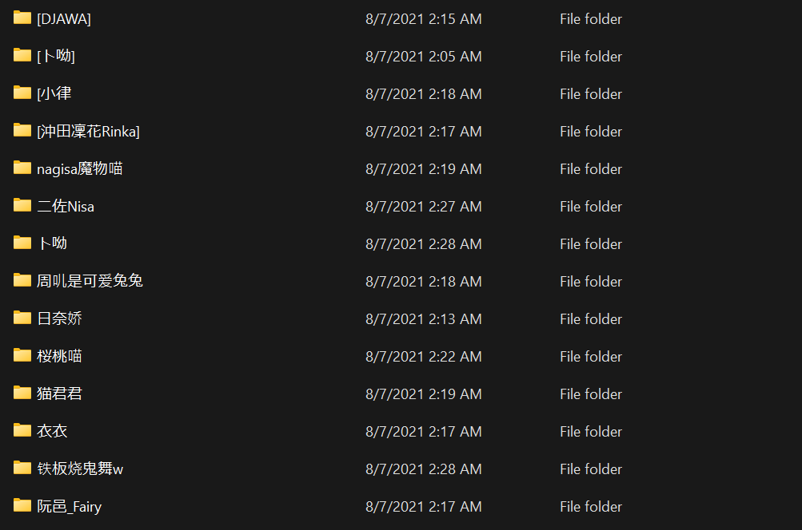

# Extract and sort your archives simply.  
## 原理
通过正则表达式对压缩包名进行分析处理，并将其解压到根据表达式生成的文件夹中。
## Depends:
* Packages
    * 7z 
    * if you already have 7z, you don't need the followings:
        * unzip 
        * unrar 
``` Shell
Usages:
    -h|help Display this message.
    -x      Specify your Resource Dir.
    -o      Specify the Output Dir.
    -s      Signal to run.
    --noask Dont Ask [y/n].
    --mvdir move uncompressed Image/Video to OutputDir directly.
Sample: python tagmyarchive.py -x <ResourceDir> -o <ExtractTargetDir>
```
#### run with `-s`, set them in .py
``` Python
dlfolder=""  # archives directory
ext=""       # extract directory
```
before | after
-------|------
 | 
